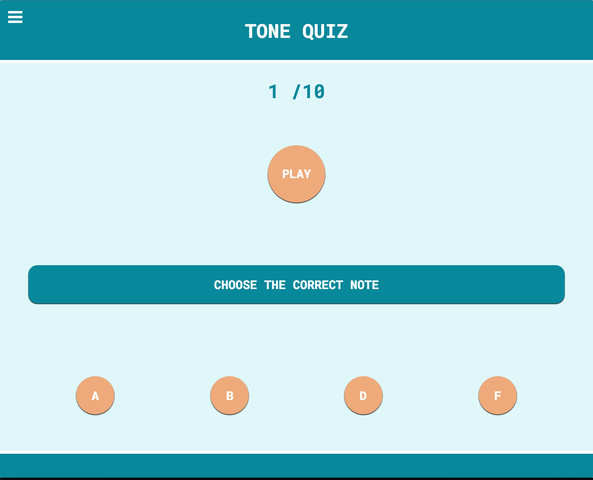
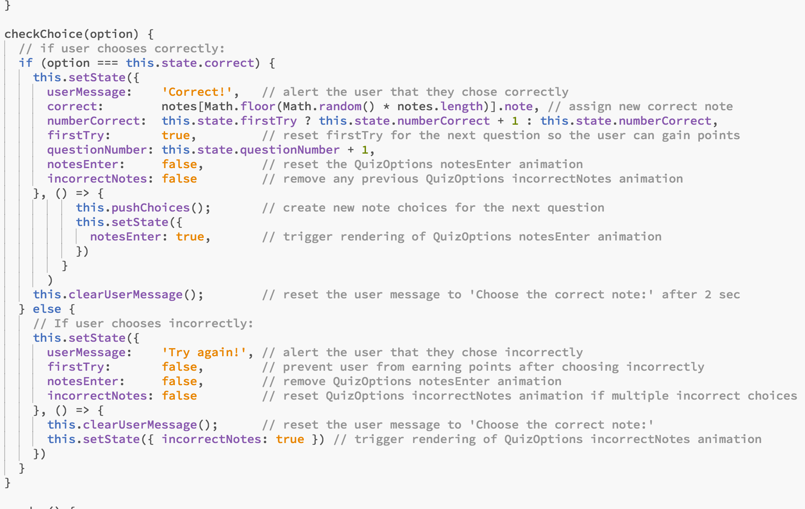

 
#[Tone Quiz](https://ztotta.github.io/tone-quiz) 

This is a single-page React App that lets users test their pitch recognition in a short quiz and then receive their results. 

As a pure frontend app, my focus was on the UI / UX, with special attention paid to component responsiveness, React Motion animations, and mobile-first design. I employed React Music to handle the pitch creation. 
							 
The biggest challenges here were in setting up the game logic and synchronizing the animations with the user actions. This snippet shows the logic that checks for correctness after a user guess, triggering animations, updating the state of the user's quiz, and readying the next question, depending on whether the user guessed correctly or not:

The app is hosted [here](https://ztotta.github.io/tone-quiz).

